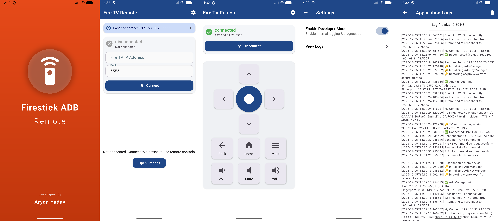

# Firestick ADB Remote

Firestick ADB Remote is a Flutter application that allows you to control your Firestick device over Wi-Fi using ADB (Android Debug Bridge). This app provides a user-friendly interface to interact with your Firestick device without needing a physical remote.

## Screenshots
   
   
## Features

- **Connect via ADB over Wi-Fi**: Easily connect to your Firestick device using its IP address and port.
- **Remote Control**: Navigate, select, and control your Firestick device with on-screen buttons.
- **Volume Control**: Increase and decrease the volume directly from the app. This feature is especially useful for:
  - Firestick Lite users, as it lacks physical volume buttons.
  - Controlling the volume of Bluetooth speakers connected directly to your Firestick.
  - The main motivation for creating this app was to address this limitation.
- **Secure Storage**: Store your Firestick's connection details securely using `flutter_secure_storage`.
- **Network Connectivity**: Automatically detect network changes with `connectivity_plus`.
- **Customizable Splash Screen**: A visually appealing splash screen using `flutter_native_splash`.

## Getting Started

### Prerequisites

- Ensure your Firestick device has ADB debugging enabled.
  - Go to **Settings > My Fire TV > Developer Options > ADB Debugging** and turn it on.
- Connect your Firestick and the device running this app to the same Wi-Fi network.

### Usage

1. Open the app.
2. Enter your Firestick's IP address and port (default port is usually `5555`).
3. Once connected, you can use the app as a normal Firestick remote.
4. Use the volume control feature to adjust the volume, especially if you are using a Bluetooth speaker connected directly to your Firestick.


### Installation

1. Clone this repository:
   ```bash
   git clone https://github.com/aryany9/firestick_adb_remote.git
   ```
2. Navigate to the project directory:
   ```bash
   cd firestick_adb_remote
   ```
3. Install dependencies:
   ```bash
   flutter pub get
   ```
4. Run the app:
   ```bash
   flutter run
   ```

## Building the App

To build the app for release:

1. Build the app bundle:
   ```bash
   flutter build appbundle --release
   ```
2. Build the APK:
   ```bash
   flutter build apk --release
   ```

## Dependencies

This project uses the following dependencies:

- `flutter_adb`: Native Dart ADB client for network communication.
- `basic_utils`: For encoding/decoding RSA keys in PEM format.
- `flutter_secure_storage`: Secure storage for sensitive data.
- `provider`: State management solution.
- `path_provider`: Access to commonly used file system locations.
- `connectivity_plus`: Network connectivity monitoring.
- `flutter_native_splash`: Custom splash screen setup.

## Contributing

Contributions are welcome! If you have suggestions for improvements or new features, feel free to open an issue or submit a pull request.

## License

This project is licensed under the MIT License. See the [LICENSE](LICENSE) file for details.

## Contact

For any inquiries or support, please contact [Aryan Yadav](mailto:aryany9@example.com).